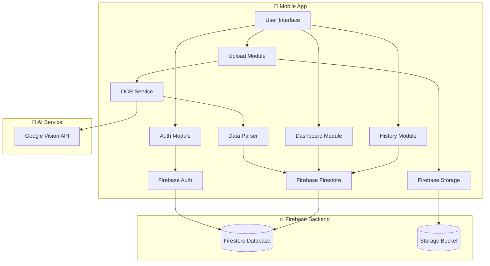

# PES Analysis - Project Plan

## Overview
A React Native mobile application for analyzing Pro Evolution Soccer (PES) game matches by uploading screenshots. The app uses AI-powered OCR to extract match statistics and provides detailed analytics dashboard.

## Tech Stack
- **Framework**: Expo SDK 52 + React Native
- **Language**: TypeScript
- **Authentication**: Firebase Authentication
- **Database**: Firebase Firestore
- **Storage**: Firebase Storage
- **OCR Service**: Google Cloud Vision API / Azure Computer Vision
- **Navigation**: React Navigation v6
- **State Management**: Zustand
- **Charts**: React Native Chart Kit
- **UI Library**: React Native Paper / NativeBase

## System Architecture



## Database Schema

### Users Collection
```typescript
{
  uid: string,
  email: string,
  displayName: string,
  photoURL: string,
  createdAt: Timestamp,
  preferences: {
    defaultTeam: string,
    gameMode: 'master_league' | 'online' | 'exhibition',
    difficulty: 'beginner' | 'regular' | 'professional' | 'top_player' | 'superstar',
    halfLength: number // minutes
  },
  stats: {
    totalMatches: number,
    wins: number,
    draws: number,
    losses: number,
    winRate: number,
    totalGoals: number,
    totalShots: number,
    totalOnTarget: number,
    averagePossession: number
  }
}
```

### Matches Collection
```typescript
{
  id: string,
  userId: string,
  createdAt: Timestamp,
  screenshotUrl: string,
  
  // Match Info
  matchType: 'master_league' | 'online' | 'exhibition',
  gameDate: Timestamp,
  
  // Team Info
  userTeam: {
    name: string,
    score: number
  },
  opponentTeam: {
    name: string,
    score: number
  },
  
  // Result
  result: 'win' | 'draw' | 'loss',
  
  // Statistics (Extracted from screenshot)
  statistics: {
    possession: { user: number, opponent: number },
    shots: { user: number, opponent: number },
    shotsOnTarget: { user: number, opponent: number },
    fouls: { user: number, opponent: number },
    corners: { user: number, opponent: number },
    freeKicks: { user: number, opponent: number },
    passes: { user: number, opponent: number },
    crosses: { user: number, opponent: number },
    interceptions: { user: number, opponent: number },
    tackles: { user: number, opponent: number },
    saves: { user: number, opponent: number }
  },
  
  // Analysis
  analysis: {
    shotAccuracy: number,
    passAccuracy: number,
    performanceRating: number,
    winningProbability: number
  }
}
```

## Screens & Navigation Structure

```
Auth Stack (Not Authenticated)
├── Welcome Screen
├── Login Screen
├── Register Screen
└── Forgot Password Screen

Main Tabs (Authenticated)
├── Dashboard Tab
│   ├── Dashboard Home
│   ├── Match Detail
│   └── Statistics Detail
├── Upload Tab
│   ├── Upload Screen
│   ├── Preview & Edit
│   └── Processing Screen
├── History Tab
│   ├── Match List
│   ├── Filters
│   └── Match Detail
└── Settings Tab
    ├── Profile
    ├── Preferences
    ├── Data Export
    └── About
```

## Key Features

### 1. Screenshot Upload & OCR
- Camera or gallery selection
- Image preprocessing (crop, enhance contrast)
- Google Vision API for text recognition
- PES scoreboard format parser
- Manual correction interface

### 2. Statistics Dashboard
- Summary cards (Total matches, Win rate, Goals, Shots)
- Recent performance graph
- Head-to-head comparison
- Best/worst performing teams

### 3. Match History
- Chronological match list
- Filter by team, result, date range
- Search functionality
- Infinite scroll pagination

### 4. Detailed Analytics
- Shot accuracy trends
- Possession vs result correlation
- Performance rating over time
- Winning probability calculator

## OCR Data Extraction Strategy

The PES scoreboard typically shows:
```
Team Name    Score    Score    Team Name
User Team      3   -   1     Opponent

Statistics Table:
Possession    55%  -  45%
Shots         12   -   8
Shots on Target 7 -   4
Fouls         3    -   5
Corners       4    -   2
...
```

**Extraction Process:**
1. Detect scoreboard region using image segmentation
2. Run OCR on the detected region
3. Parse extracted text using regex patterns
4. Map values to structured data
5. Validate and flag anomalies for manual review

## Implementation Phases

### Phase 1: Foundation (Week 1)
- Project setup with Expo
- Firebase configuration
- Navigation structure
- Auth screens implementation

### Phase 2: Core Features (Week 2)
- Screenshot upload functionality
- OCR integration
- Match data parser
- Firestore data operations

### Phase 3: Dashboard & History (Week 3)
- Dashboard UI with statistics cards
- Chart implementations
- Match history list
- Match detail view

### Phase 4: Polish & Optimization (Week 4)
- Error handling
- Loading states
- Offline support
- Performance optimization
- Testing

## Dependencies to Install

```json
{
  "core": [
    "expo",
    "react-native",
    "typescript"
  ],
  "navigation": [
    "@react-navigation/native",
    "@react-navigation/bottom-tabs",
    "@react-navigation/stack",
    "react-native-screens",
    "react-native-safe-area-context"
  ],
  "firebase": [
    "firebase",
    "@react-native-firebase/app",
    "@react-native-firebase/auth",
    "@react-native-firebase/firestore",
    "@react-native-firebase/storage"
  ],
  "ui": [
    "react-native-paper",
    "react-native-vector-icons",
    "react-native-chart-kit"
  ],
  "state": [
    "zustand"
  ],
  "utilities": [
    "react-native-image-picker",
    "expo-image-manipulator",
    "date-fns",
    "react-native-keyboard-aware-scroll-view"
  ]
}
```

## Next Steps

1. Review and approve this plan
2. Create Firebase project and get configuration
3. Set up Google Cloud Vision API credentials
4. Begin Phase 1 implementation

Would you like me to proceed with creating the project structure and starting the implementation?